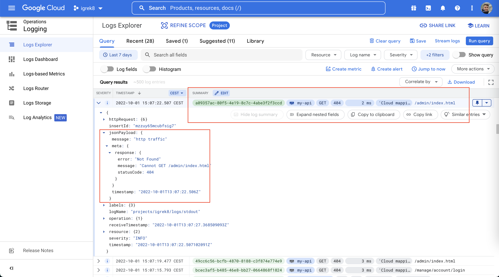

# [Structured logging](https://cloud.google.com/logging/docs/structured-logging) for express.js app in GKE

[](https://www.npmjs.com/gc-json-logger-express)
[](https://coveralls.io/github/igrek8/gc-json-logger-express?branch=main)


[](https://npm.runkit.com/gc-json-logger-express)

## Precaution

The logger makes use of [`async_hooks`](https://nodejs.org/api/async_hooks.html#async-hooks) module which is currently **experimental**. However, the use of `async_hooks` mechanism was at basic.

## Installation

```bash
npm install --save gc-json-logger gc-json-logger-express

yarn add gc-json-logger gc-json-logger-express
```

## View in Google Cloud Logging



## Integration

```js
const { Logger, Severity } = require('gc-json-logger');
const { log } = require('gc-json-logger-express');
const express = require('express');

const app = express();

/* Set desired application log level */
Logger.setLevel(Severity.DEBUG);

/* Filter sensitive data or transform log entry */
app.use(log((_req, _res, entry) => ({ severity: Severity.INFO, ...entry })));

app.use(express.text());
app.use(express.json());
app.use((req, res) => res.status(200).send(req.body));

app.listen(3000);
```

```bash
curl -X POST "http://localhost:3000/echo" \
  -H "Content-Type: text/plain" \
  -d 'Hello world!'
```

```json
{
  "severity": "INFO",
  "timestamp": "2022-01-01T00:00:00.000Z",
  "message": "200 POST /echo (19ms)",
  "httpRequest": {
    "protocol": "HTTP/1.1",
    "latency": "19ms",
    "requestSize": "141",
    "remoteIp": "::ffff:127.0.0.1",
    "requestUrl": "http://localhost:3000/echo",
    "requestMethod": "POST",
    "responseSize": "239",
    "userAgent": "curl/7.79.1",
    "serverIp": "::ffff:127.0.0.1:3000",
    "status": 200
  },
  "logging.googleapis.com/operation": {
    "id": "53d9fbf1-7091-4dfa-a6b9-63e8c505d720"
  },
  "meta": {
    "request": {
      "headers": {
        "host": "localhost:3000",
        "user-agent": "curl/7.79.1",
        "accept": "*/*",
        "content-type": "text/plain",
        "content-length": "12"
      },
      "body": "Hello world!"
    },
    "response": {
      "headers": {
        "x-powered-by": "Express",
        "content-type": "text/html; charset=utf-8",
        "content-length": "12",
        "etag": "W/\"c-00hq6RNueFa8QiEjhep5cJRHWAI\""
      },
      "body": "Hello world!"
    }
  }
}
```
